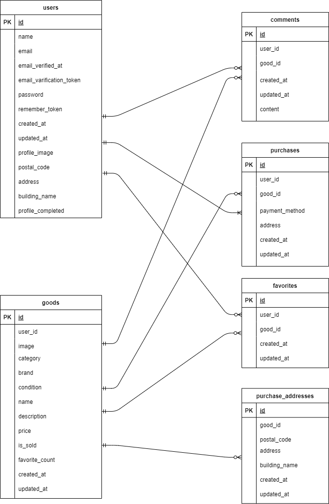

# コーチテックフリーマーケット（Pro試験、拡張機能実装版）

## 概要

本アプリは、Laravelを用いて構築されたフリーマーケットアプリです。  
ユーザーは商品を出品・購入できるほか、以下の拡張機能を実装済みです。

---

## 実装済み機能（拡張部分）

| 項目                   | 対応状況  | 補足                                       |
| -------------------- | ----- | ---------------------------------------- |
| **取引中商品確認機能**        | ✅ 実装済 | マイページ `/mypage/transactions` で取引中商品と通知件数が確認可能 |
| **取引チャット遷移機能**       | ✅ 実装済 | 商品押下でチャット画面に遷移可能                         |
| **別取引遷移機能**          | ✅ 実装済 | チャット画面のサイドバーから他取引チャットに遷移可能               |
| **取引自動ソート機能**        | ✅ 実装済 | 新着メッセージ順でソート表示                           |
| **取引商品新規通知確認機能**     | ✅ 実装済 | 未読メッセージがある取引に通知バッジ＆件数表示                  |
| **評価平均確認機能**         | ✅ 実装済 | マイページにて平均評価を四捨五入で表示。未評価ユーザーは非表示          |
| **取引チャット機能（表示・投稿）**  | ✅ 実装済 | 本文・画像両対応（画像は`.jpeg` or `.png`）           |
| **バリデーション**          | ✅ 実装済 | FormRequestで実装：本文必須（最大400文字）、画像は拡張子制限あり  |
| **エラーメッセージ表示**       | ✅ 実装済 | 指定通りのエラーメッセージを入力欄上部に表示                   |
| **入力情報保持機能（本文）**     | ✅ 実装済 | 遷移後もセッション保持で復元可能（本文のみ）                   |
| **メッセージ編集機能**        | ✅ 実装済 | 投稿済みメッセージの編集に対応                          |
| **メッセージ削除機能**        | ✅ 実装済 | 投稿済みメッセージの削除に対応                          |
| **取引後評価機能（購入者）**     | ✅ 実装済 | 「取引完了」モーダルから評価可能                         |
| **取引後評価機能（出品者）**     | ✅ 実装済 | 購入者が取引完了後、チャットを開くと評価可能                   |
| **取引後画面遷移**          | ✅ 実装済 | 評価送信後は商品一覧に自動遷移                          |
| **メール送信機能（MailHog）** | ✅ 実装済 | 取引完了後、出品者へ通知メール送信                        |

---

## 補足

- Figmaデザインとの一部差異はありますが、仕様通りの機能実装を優先して対応しています。
- 購入処理（例：PurchaseController@store）は今回のテスト要件に含まれておらず、機能としては未完成です。
- そのため、シーディングによって購入済みの状態を再現しています（評価・チャット動作確認のため）。  

---

## セットアップ手順

### 1. リポジトリクローン & コンテナ起動

```bash
git clone https://github.com/coachtech-material/laravel-docker-template.git coachtechfreemarket
cd coachtechfreemarket

docker-compose build
docker-compose up -d
```

### 2. .env 作成 & マイグレーション

```bash
cp .env.example .env
docker-compose exec app php artisan key:generate
```

`.env` の主な設定値：

```
APP_URL=http://localhost
DB_DATABASE=laravel_db
DB_USERNAME=laravel_user
DB_PASSWORD=laravel_pass

MAIL_MAILER=smtp
MAIL_HOST=mailhog
MAIL_PORT=1025
```

## シーディングについて

本プロジェクトでは、取引チャット機能・評価機能の検証を行いやすくするため、以下の Seeder を実装・改訂しています。

- `CategorySeeder`  
  新たに `categories` テーブルを作成し、カテゴリの初期データを投入できるようにしました。

- `ItemSeeder`  
  既存の `ItemSeeder` を見直し、ユーザー・カテゴリとの関連を明確にしました。

- `TransactionSeeder`  
  試験用として独自に用意し、チャットや評価のテストが可能になる取引データを登録しています。

- `EvaluationSeeder`  
  試験用として独自に用意し、評価閲覧のテストが可能になりました。


### 初期データの内容（例）

- ユーザーは3名登録されています：
  - `User One`, `User Two`: 出品者
  - `User Three`: 購入者  

- `User Three` は複数の商品を購入済みであり、該当するチャットメッセージも含まれています。  

### シーディングの実行方法

```bash
docker-compose exec app php artisan migrate --seed
```

- データ初期化:  
  `docker-compose exec app php artisan migrate:fresh --seed`

---

## 使用技術

| 項目         | 内容               |
|--------------|--------------------|
| フレームワーク | Laravel 8.83.8      |
| 言語         | PHP 7.4.9           |
| データベース | MySQL               |
| 決済         | Stripe              |
| メール      | MailHog（ポート:8025） |
| 実行環境    | Docker              |

---

## 主な画面URL

### 一般ユーザー用

- `/` : トップ（おすすめ商品）
- `/item/{id}` : 商品詳細
- `/purchase/{id}` : 購入画面
- `/mypage` : プロフィールページ
- `/mypage?tab=buy` : 購入履歴
- `mypage.transactions` : 取引中の商品一覧（購入者、販売者共通）  

### 出品者用

- `/sell` : 出品ページ
- `/mypage?tab=sell` : 出品履歴 （マイページ）

---

## チャット機能関連のルート例  

- `/chat/buyer/{purchase_id}` : チャット詳細（購入者用ビュー）  
- `/chat/seller/{purchase_id}` : チャット詳細（出品者用ビュー）  


---

## テスト関連

```bash
cp .env.testing.example .env.testing
docker-compose exec app vendor/bin/phpunit
```

特定のテストだけを実行するには：

```bash
docker-compose exec app vendor/bin/phpunit --filter test_method_name
```
>> 注：この度の試験では単体テストの実装はしておりません  
---

## ストレージ設定

- 商品画像：`public/goods`
- プロフィール画像：`public/profile_images`

シンボリックリンク作成：

```bash
docker-compose exec app php artisan storage:link
```

---

## ER図



---

## 備考

- 本プロジェクトは COACHTECH の Pro 入会テスト用の拡張機能実装課題として取り組んでいます。
- 限られた期間内で設計・開発・検証まで対応しました。
- 拡張機能の実装は要件通りで、特にチャット・評価・通知まわりに注力しています。

```

---
