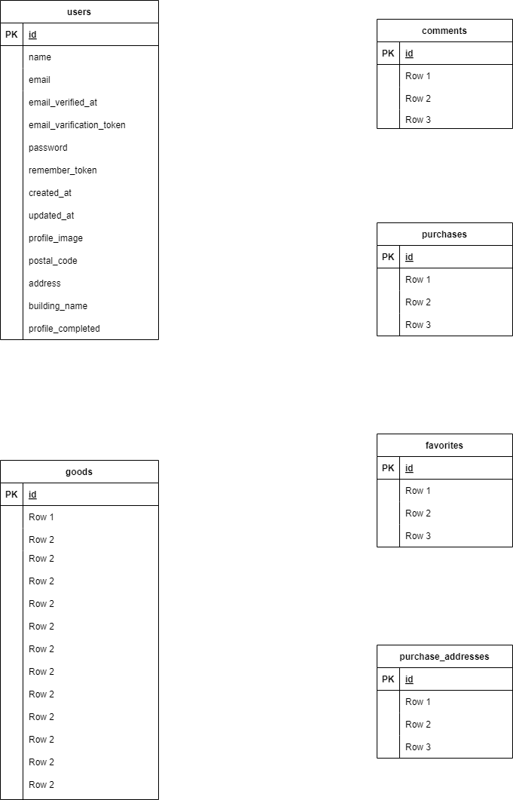

# アプリケーション名
コーチテックフリーマーケット(coachtechfreemarket)
## 環境構築
[github.com:coachtech-material/laravel-docker-template.git ](https://github.com/coachtech-material/laravel-docker-template)   
docker-compose build  
docker-compose up -d  

docker-compose exec app php artisan migrate  
docker-compose exec app php artisan db:seed  

DB_CONNECTION=mysql  
DB_HOST=mysql  
DB_PORT=3306  
DB_DATABASE=laravel_db  
DB_USERNAME=laravel_user  
DB_PASSWORD=laravel_pass  
## 使用技術(実行環境)
Laravel 8.83.8
PHP 7.4.9
mysql  Ver 15.1 
Docker
## ER図

## URL
開発環境：http://localhost/  
'/'　トップページ（おすすめ商品）　検索の際searchが入る  
'/?tab=mylist'　マイリスト　検索の際searchが入る  
'/register'　会員登録画面  
'/login'　会員のログイン画面  
'/item/{id}'　商品詳細画面    
'/purchase/{id}'　商品購入画面    
'/purchase/address/{id}'　お届け先住所変更ページ  
'/sell'　商品出品画面  
'/mypage'　プロフィール画面  
'/mypage?tab=buy'　マイページ_購入した商品  
'/mypage?tab=sell'　マイページ_出品した商品  　  
